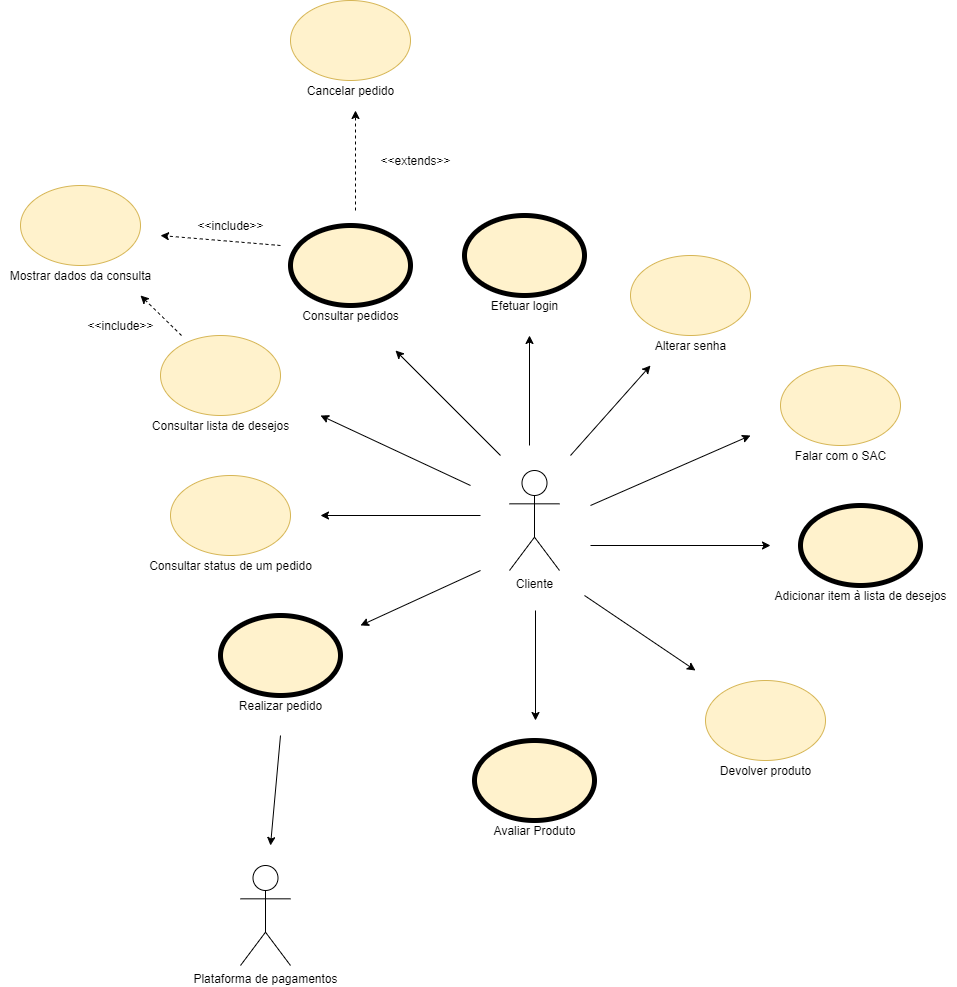

# Projeto APS - Plataforma de E-Commerce e-Shop                                                                                  
Projeto para a disciplina IF718 - Análise e Projeto de Sistemas

### Equipe

Ewerton Lima   - ehzcl

Luan Advincula - lssa

Paulo Aragão   - pvsa

### Diagrama

### Entrega 1

[Proposta de projeto](https://docs.google.com/document/d/17RXGTigwaIQsoJafAuFN54eFfRCHrjHxu_DlcEcw50U/edit?usp=sharing)

### Entrega 2

#### Correções e RUP

.png)

##### Arquitetura corrigida

[Mapeamento das classes de analise em elementos de projeto](https://docs.google.com/document/d/1i-lYCq-MT9uNl121jF3XeY9Z8JBGLJ_O7n3b9_RpHL8/edit?usp=sharing)

[Classes de analise](https://github.com/ehzcl/projeto_aps/blob/main/docs/classes%20de%20analise/classe%20de%20analise.md)

[Diagrama de sequencia](https://github.com/ehzcl/projeto_aps/blob/main/docs/diagramas%20de%20sequencia/diagrama%20de%20sequencia.md)

[Apresentacao](https://docs.google.com/presentation/d/1bdRAnWXNkKujat41ceLxej39v_7sUJNU-56EveHrl_0/edit?usp=sharing)

[SOA](https://github.com/ehzcl/projeto_aps/tree/soa)

