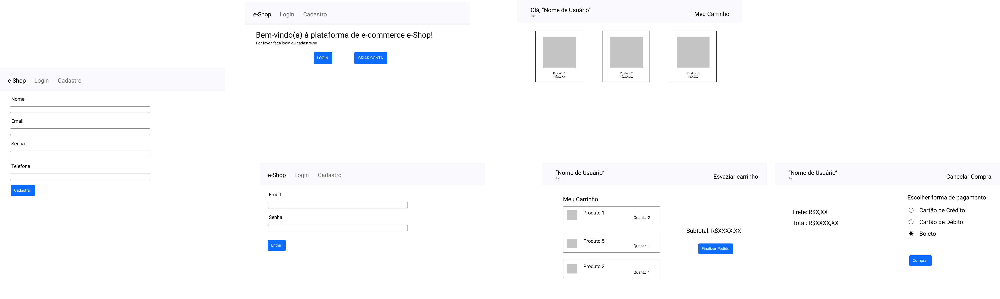

# Projeto APS - Plataforma de E-Commerce e-Shop                                                                                  
Projeto para a disciplina IF718 - Análise e Projeto de Sistemas

### Equipe

Ewerton Lima   - ehzcl

Luan Advincula - lssa

Paulo Aragão   - pvsa

### Modelo de informacao de negocio

### Arquitetura de servicos

### Modelo navegacional

### Prototipo da GUI

### Projeto frontend

### Arquitetura de servicos

### Diagrama de componentes de servico

### Diagrama de componentes do sistema

### Casos de uso em pacotes

[componentes de acesso](./docs/componentes%20de%20acesso/componentes%20de%20acesso.md)

[Modelo de interacao de servicos](./docs/modelo%20de%20interacao%20de%20servicos/modelo%20de%20interacao%20de%20servicos.md)

